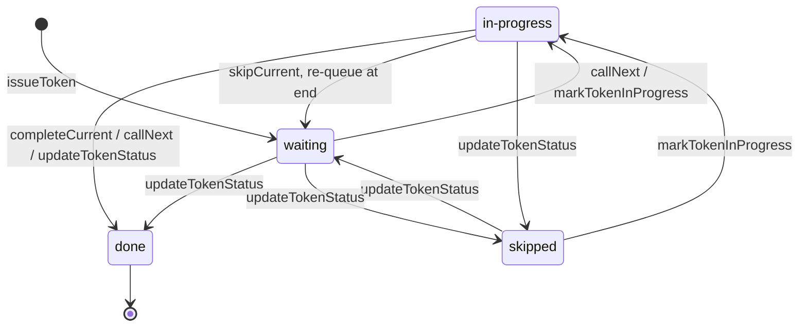
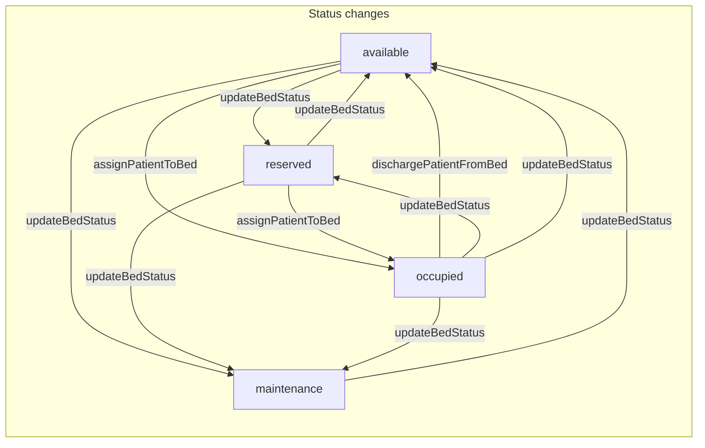

# Medicare HMS – Project Flow

This file is the **single place** for architecture, routes, and **end-to-end workflows** implemented in the repo. Update it when you add or change flows.

## Contents (workflow index)

| Section | What it covers |
|---------|----------------|
| [UI stack](#ui-stack) | Tailwind, toasts, Vite tips |
| [Bootstrap & routes](#bootstrap) | Store, `AppRoutes` |
| [Departments vs wards](#departments-vs-inpatient-wards) | Why “top 5 departments” ≠ “3 wards” |
| [Auth & roles](#auth--roles) | Login, roles, `ProtectedRoute` |
| [Login / switch account](#login-flow) | Demo users |
| [Stores](#stores-redux-rtk) | Redux Toolkit slices (including OPD queue) |
| [Week 2 — Dashboards](#week-2--dashboard-ui-foundation) | Widgets per role |
| [Week 3 — Patients (API)](#week-3--patient-management-part-1) | JSON Server, registration |
| [Week 4 — Profile + queue](#week-4--patient-management-part-2--queue-start) | Edit, OPD start |
| [Week 5 — Queue + beds](#week-5--queue-completion--bed-management) | Full OPD + bed flows + Mermaid |
| [Week 6 — Appointments](#week-6--appointment-scheduling) | Calendar, slots, book, conflict, reschedule |
| [Patient CRUD flow (consolidated)](#patient-crud-flow-consolidated) | List → register → view → edit |
| [Receptionist quick actions](#receptionist-quick-actions-routes) | Links from dashboard |
| [Placeholder routes](#placeholder-routes-not-yet-implemented) | Sidebar items without full UI |
| [Data sources summary](#data-sources-summary) | Redux vs JSON Server vs mocks |

---

## Departments vs inpatient wards

- **`config/departments.ts` — `OPD_DEPARTMENTS`** — Clinical / OPD service names (General OPD, Cardiology, …). Used for **token issue**, **“Top 5 departments”** chart (`MOCK_TOP_DEPARTMENTS`), and **doctor availability** mock rows. Count can be **five or more** departments.
- **`config/wards.ts` — `WARDS`** — Inpatient **bed units** (`W1` General Ward, `W2` ICU, `W3` Pediatrics). Used only for **bed management** and related mocks/alerts.

These are **different axes** (outpatient load vs physical wards). Having **5 departments** in analytics and **3 wards** in bed management is **expected** and correct.

---

## UI stack
- **Typography:** Plus Jakarta Sans (Google Fonts) + Tailwind `@theme --font-sans` in `index.css`.
- **Chrome:** Soft gradient page background (`.app-surface-gradient`), glass-style Navbar/Sidebar (`backdrop-blur`, translucent panels), `rounded-2xl` cards with light rings/shadows, gradient primary buttons.
- **Icons:** [Lucide React](https://lucide.dev/) — `config/navIcons.tsx`; Navbar, Sidebar, Login, dashboards, queue, placeholders.
- **Toasts:** [react-hot-toast](https://react-hot-toast.com/) — `AppToaster` in `App.tsx`, `lib/notify.ts`.

### Vite: `504 (Outdated Optimize Dep)` on `.vite/deps/…`
Happens when the dev server’s **pre-bundle cache** (`node_modules/.vite`) is older than your dependencies (e.g. after `npm install` of new packages). **Fix:** stop the dev server, run `rm -rf node_modules/.vite`, start again with `npm run dev` — or use `npm run dev:force` once. `vite.config.ts` lists `lucide-react` and `react-hot-toast` under `optimizeDeps.include` to reduce repeats.

## Bootstrap
- **main.tsx** → `Provider(store)` → **App.tsx** → `BrowserRouter` → **AppRoutes**
- **store** (`app/store.ts`): Auth preloaded from `localStorage` (`medicare_auth`). Middleware syncs login/logout to `localStorage`.

## Route Tree
| Path | Component | Access |
|------|-----------|--------|
| `/login` | Login | Public |
| `/` | ProtectedRoute → MainLayout | Auth + role |
| `/` (index) | RedirectToDefault | → role default dashboard |
| `/admin` | AdminDashboard | admin |
| `/admin/opd-queue` | OPDQueuePage | admin |
| `/admin/beds` | AdminBedsPage | admin |
| `/doctor` | DoctorDashboard | doctor |
| `/receptionist` | ReceptionistDashboard | receptionist |
| `/receptionist/queue` | ReceptionistQueue → OPDQueuePage | receptionist |
| `/receptionist/registration` | PatientRegistrationPage | receptionist |
| `/admin/patients` | PatientListPage | admin |
| `/admin/patients/new` | PatientRegistrationPage | admin |
| `/admin/patients/:patientId` | PatientProfilePage | admin |
| `/admin/patients/:patientId/edit` | PatientEditPage | admin |
| `/nurse` | NurseDashboard | nurse |
| `/nurse/beds` | NurseBeds | nurse |
| `/access-denied` | AccessDenied | any authenticated |
| `/admin/appointments` | AppointmentsPage (`admin`) | admin |
| `/admin/prescriptions` | PrescriptionsPage (`admin`) | admin |
| `/admin/doctors` | DoctorDirectoryPage | admin |
| `/admin/reports` | ReportsPage | admin |
| `/doctor/patients` | PlaceholderPage | doctor |
| `/doctor/prescriptions` | PrescriptionsPage (`doctor`) | doctor |
| `/doctor/schedule` | AppointmentsPage (`doctor`) | doctor |
| `/receptionist/appointments` | AppointmentsPage (`receptionist`) | receptionist |
| `/nurse/vitals` | PlaceholderPage | nurse |
| `*` | Navigate to `/` | — |

## Departments (`config/departments.ts`)
- **OPD / clinical:** `OPD_DEPARTMENTS` — shared by queue counter dropdown (`QueueControls`) and `MOCK_TOP_DEPARTMENTS` / doctor mock rows in `dashboardMockData.ts`.

## Wards (`config/wards.ts`)
- **Single source of truth** for inpatient wards: **`W1` — General Ward**, **`W2` — ICU**, **`W3` — Pediatrics**.
- Use `WARDS`, `wardDisplayName(id)`, and `wardRoomLabel(wardId, bedNumber)` in beds, mocks, and alerts so labels stay consistent.

## Auth & roles

Config: `config/roles.ts`.

- **Roles:** admin, doctor, receptionist, nurse
- **Default dashboards:** admin→`/admin`, doctor→`/doctor`, receptionist→`/receptionist`, nurse→`/nurse`
- **ProtectedRoute:** No user → `/login`. User but wrong role for path → `/access-denied`. Else → render child.

## Login Flow
1. User on `/login` clicks a role card.
2. `dispatch(login({ id, role, name, avatar }))` → store + `localStorage`.
3. `navigate(getDefaultDashboard(role))` → role’s dashboard.

## Switch Account (Navbar)
1. User opens dropdown, picks another demo user.
2. `dispatch(login(toAuthUser(u)))` then `setTimeout(() => navigate(getDefaultDashboard(u.role)), 0)`.
3. User and URL change to that role’s dashboard.

## Layout
- **MainLayout:** Navbar + Sidebar + `<Outlet />`.
- **Sidebar:** Links from `SIDEBAR_LINKS[user.role]`; toggle from `ui.sidebarOpen`.

## Stores: Redux (RTK)

### Redux (`app/store.ts`)
| Slice | Purpose | Used in |
|-------|--------|--------|
| auth | user, isAuthenticated; synced with localStorage | ProtectedRoute, Login, Navbar, Sidebar, useAuth |
| queue | OPD tokens: `queue[]`, `currentToken`, `simulationRunning`, `servedToday`, `nextTokenId`; actions: `issueToken`, `callNext`, `completeCurrent`, `skipCurrent`, `resetQueue`, `setSimulationRunning`, `updateTokenStatus`, `markTokenInProgress`; **`formatOpdTokenLabel`** for display | `OPDQueuePage`, `QueueBoard`, `QueueControls`, `QueueAnalytics`, `QueuePublicBoard`, `useQueueAutoAdvance`; **AdminDashboard**, **ReceptionistDashboard**, **ReportsPage** |
| beds | `Bed` (`status`, optional `patientId` / `occupantName`), `wardSummary`; actions: `setBeds`, `updateBedStatus`, `assignPatientToBed`, `dischargePatientFromBed` | AdminBedsPage, NurseBeds, NurseDashboard, BedGrid |
| appointments | `doctors` (seeded schedules), `appointments[]`; actions: `bookAppointment`, `rescheduleAppointment`, `cancelAppointment`, `updateAppointmentStatus`; persisted to `localStorage` | AppointmentsPage (admin / receptionist / doctor schedule); **doctor pick for OPD** via `DEFAULT_SCHEDULE_DOCTORS` |
| alerts | last 20 alerts | AdminDashboard, NotificationBell |
| ui | sidebarOpen, theme, activeFilters | Sidebar |
| prescriptions | Rx list; persisted to `localStorage` | PrescriptionsPage |

### OPD queue (`queueSlice.ts`)

| Field / action | Description |
|----------------|-------------|
| `queue[]` | `{ tokenId, patientName, department, doctorId, doctorName, issuedAt, status }` — `status`: `waiting` \| `in-progress` \| `done` \| `skipped` |
| `currentToken` | `number \| null` — active **`tokenId`** (display: `formatOpdTokenLabel` → e.g. `#001`) |
| `simulationRunning` | When true, **`useQueueAutoAdvance`** runs `setInterval` → `dispatch(callNext)` |
| `servedToday` | Increments when tokens become `done` (call next, complete, or status update) |
| `issueToken` | Auto-increments `tokenId`, sets `issuedAt`, assigns **doctor** from department via `opdQueueDoctors.ts` → `DEFAULT_SCHEDULE_DOCTORS` |
| `callNext` / `completeCurrent` / `skipCurrent` / `resetQueue` | Desk flows (same semantics as before; IDs are numeric) |
| `updateTokenStatus` / `markTokenInProgress` | Row controls on `QueueBoard` |
| `setSimulationRunning` | **Start simulation** / **Stop simulation** |

**UI:** `OPDQueuePage` — `QueuePublicBoard`, `QueueAnalytics`, `QueueControls`, `QueueBoard`; `useQueueAutoAdvance(intervalMs)` on the page. **Consumers outside the queue module:** `AdminDashboard`, `ReceptionistDashboard`, `ReportsPage` (`useSelector` + `formatOpdTokenLabel` from `queueSlice`).

## Hook
- **useAuth()** → `{ user, isAuthenticated, role, logout }` from auth store.

---

## Week 2 — Dashboard (UI Foundation)

### Dashboard layout (all roles)
- Each role has a dedicated dashboard page with a welcome header and a grid of widgets.
- **Admin** (`/admin`), **Doctor** (`/doctor`), **Receptionist** (`/receptionist`), **Nurse** (`/nurse`).

### Reusable UI components
- **DashboardCard** (`components/ui/DashboardCard.tsx`) — Container with optional title, border, shadow, dark-mode support.
- **StatCard** (`components/ui/StatCard.tsx`) — Label, value, optional subLabel and icon; accent variants (blue, green, amber, red, slate).

### Charts (Recharts) — admin
- **Bed occupancy donut + “Bed occupancy” stat card** — **live** from Redux `beds.beds` (counts by status; % occupied = occupied / total beds). Same data as **Bed management** / nurse grid.
- **Revenue (bar)** — mock `MOCK_REVENUE_DATA` in `dashboardMockData.ts`.
- **Top 5 departments (horizontal bar)** — mock `MOCK_TOP_DEPARTMENTS` (**clinical departments**, not ward bed counts — see [Departments vs inpatient wards](#departments-vs-inpatient-wards)).
- Other admin stat cards: mix of mock (`MOCK_PATIENTS_TODAY`, revenue headline) and **live** OPD queue from **Redux** (`queueSlice` / `currentToken` as `#nnn`, waiting/done counts) and **live** alerts (last 5).

### Role dashboards (widgets)

| Role | Widgets |
|------|--------|
| **Admin** | Stat cards (patients today, bed occupancy %, OPD queue, revenue); Bed occupancy (donut); Revenue summary (bar); Top departments (horizontal bar); Doctor availability list; Recent alerts (last 5). |
| **Doctor** | Stat cards (prescriptions today, appointments today); Next patient card; Today’s appointments list; Schedule summary. |
| **Receptionist** | Stat cards (registration count, current OPD token, pending appointments); OPD queue live view (QueueBoard); Quick actions (Issue token, Register patient, Book appointment). |
| **Nurse** | Ward bed summary + occupancy; Pending vitals list; Ward bed grid (BedGrid); Recent bed status changes feed. |

### Data
- **Live (Redux Toolkit):** OPD queue (`queueSlice`: `queue`, `currentToken`, `servedToday`, `simulationRunning`); beds (`beds`, `wardSummary`); alerts; prescriptions; appointments; auth; UI sidebar/theme, etc.
- **Live (JSON Server):** patient list / register / profile / edit — when `npm run server` is running (`patientsApi.ts`).
- **Static mocks:** `dashboardMockData.ts` — registrations count, pending appointments, revenue series, top departments, doctor availability, doctor appointments, vitals list, recent bed *feed* (narrative), etc.

### UI polish
- All dashboard components use Tailwind with **dark:** variants.
- QueueBoard and BedGrid support dark mode.

---

## Week 3 — Patient management (Part 1)

### JSON Server (REST API)
- **Data file:** `server/db.json` — `{ "patients": [] }` (JSON Server watches this file).
- **Run API:** `npm run server` → `server/jsonServer.mjs` on `http://localhost:3001` — REST under **`/api/...`** (e.g. `/api/patients`) plus **`GET /api/npi`** (proxies to CMS NPPES; maps `country` → `country_code`, sets `name_purpose=Provider` when `first_name` / `last_name` are used). If `dist/` exists, the same process also serves the Vite SPA. Plain json-server only: `npm run server:plain`.
- **Client:** `src/config/api.ts` — `getJsonServerBaseUrl()` (dev default `http://localhost:3001`; production same-origin `''` → relative `/api/...` unless `VITE_JSON_SERVER_URL` is set).
- **API helpers:** `src/api/patientsApi.ts` — `fetchPatients()`, `fetchAllPatients()`, `fetchPatientById()`, `createPatient()`, `updatePatient()` (PATCH), `softDeletePatient()` (`isActive: false`).
- **Types:** `src/types/patient.ts` — `PatientRecord` (same fields as before; stored as JSON).

### Registration form
- **Component:** `src/features/patients/PatientRegistrationForm.tsx` — 5 steps (Personal → Contact → Medical → Emergency → Review) + progress bar.
- **Validation:** **React Hook Form** + **Zod** (`patientRegistrationSchema` + per-step schemas in `patientSchemas.ts`). Step “Next” validates current step via `safeParse` + `trigger`.
- **ID:** `generatePatientId()` → `MED-YYYY-XXXX` (collision check via `fetchPatients()`).
- **Routes:** `/admin/patients/new` and `/receptionist/registration` (redirect after save: admin → patient list, receptionist → dashboard).

### Patient list (admin)
- **Page:** `src/pages/PatientListPage.tsx` — active patients; search (name / phone / email / ID); filters (blood group, gender); pagination; **View** / **Edit** / **Deactivate** (soft delete).

---

## Week 4 — Patient management (Part 2) + queue start

### Patient profile & edit
- **Profile:** `PatientProfilePage` at `/admin/patients/:patientId` — tabs: Overview, Medical, Emergency.
- **Edit:** `PatientEditPage` at `/admin/patients/:patientId/edit` — reuses `PatientRegistrationForm` with `initialRecord` + `updatePatient` (PATCH).
- **Mapper:** `patientRecordToFormValues()` in `patientSchemas.ts` for edit defaults.

### OPD queue (Redux — Module 2)
- **Slice:** `src/features/queue/queueSlice.ts` — numeric **`tokenId`** (display `#001`, …); **`currentToken`** = active `tokenId` or `null`.
- **Types:** `opdQueueTypes.ts` — token shape + status union.
- **Doctor assignment:** `opdQueueDoctors.ts` — `pickDoctorForDepartment()` uses **`DEFAULT_SCHEDULE_DOCTORS`** from `appointmentsSlice` (first match on `department`, else General OPD / first seed).
- **UI:** `QueuePublicBoard` (public-style: now serving, next 5 waiting, department breakdown), `QueueAnalytics` (counts + **simulated** avg / longest wait + `servedToday`), `QueueControls` (issue name + department, **Call next**, **Complete**, **Skip & re-queue**, **Reset**, **Start / Stop simulation**, interval selector), `QueueBoard` (full list + status badges + row dropdown). **`useQueueAutoAdvance`** — `setInterval` → `dispatch(callNext)` while `simulationRunning` (default **30s**).
- **Routes:** `/receptionist/queue` and `/admin/opd-queue` share **`OPDQueuePage`** (same Redux `queue` slice).

---

## Week 5 — Queue completion + Bed management

### OPD queue — desk flow (manual)

1. **Issue token** — Receptionist/Admin enters name + department → `issueToken` → new row in `waiting` with next **`tokenId`**, **`issuedAt`**, and assigned **`doctorId` / `doctorName`**.
2. **Call next** — `callNext`: any `in-progress` → `done` (+`servedToday`); first `waiting` → `in-progress`; **`currentToken`** set to that token’s **`tokenId`**.
3. **Complete current** — `completeCurrent`: active token → `done`, clear `currentToken`.
4. **Skip & re-queue** — `skipCurrent`: active token → `waiting`, moved to **end** of the token list; the **first** `waiting` in line is promoted unless they are the **only** waiting token (then the desk stays empty until **Call next**).
5. **Row status** — `QueueBoard` select: non–in-progress changes use `updateTokenStatus` (keeps `servedToday` / `currentToken` consistent); choosing **In progress** uses `markTokenInProgress` (previous in-progress → `waiting`).
6. **Reset** — `resetQueue` clears tokens, `currentToken`, `servedToday`; UI also stops simulation.

### OPD queue — auto-advance (simulation)

1. User sets interval (default **30s**, or 15s / 8s / 4s) and clicks **Start simulation** → `setSimulationRunning(true)`.
2. `useQueueAutoAdvance` in `OPDQueuePage` runs `setInterval` → repeated `dispatch(callNext)` while **`simulationRunning`**.
3. **Stop simulation** or **Reset queue** ends the interval behavior.

### OPD queue — analytics

- **`QueueAnalytics`** — counts (waiting, in-progress, done, skipped), session token total, completion rate, **`servedToday`**, formatted **`currentToken`**, plus **simulated** average wait and longest wait (derived from `issuedAt` + small random jitter for demo).

### Bed & ward flow

1. **Ward summary** — Derived in `bedSlice` (`wardSummary` per `wardId`); `BedGrid` shows cards (free / occupied / reserved / maintenance + occupancy %).
2. **View grid** — Beds grouped by ward; color = `BedStatus`.
3. **Tap bed** — Modal: quick **status** buttons → `updateBedStatus` (leaving `occupied` clears occupant fields).
4. **Admit / assign** — On `available` or `reserved`: name (+ optional registry ID) → `assignPatientToBed` → `occupied` + summary counts updated.
5. **Discharge** — On `occupied`: `dischargePatientFromBed` → `available`, occupant cleared.
6. **Shared state** — Admin (`/admin/beds`) and Nurse (`/nurse/beds`) use the same Redux `beds` slice (session-only; not JSON Server).

### Flow diagrams (Mermaid)

**OPD token lifecycle**

**Bed status & admission**

### Key files (Week 5)

| Area | Files |
|------|--------|
| OPD queue (Redux) | `queueSlice.ts`, `opdQueueTypes.ts`, `opdQueueDoctors.ts`, `useQueueAutoAdvance.ts` |
| Queue UI | `QueuePublicBoard.tsx`, `QueueControls.tsx`, `QueueBoard.tsx`, `QueueAnalytics.tsx` |
| Queue page | `src/pages/OPDQueuePage.tsx`, `ReceptionistQueue.tsx` |
| Beds slice | `src/features/beds/bedSlice.ts` |
| Beds UI | `src/features/beds/BedGrid.tsx` |
| Pages | `AdminBedsPage.tsx`, `NurseBeds.tsx`, `NurseDashboard.tsx` |
| Routes | `src/routes/AppRoutes.tsx` (`admin/beds`) |

---

## Week 6 — Appointment scheduling

### Doctor schedules (seeded)
- **`DEFAULT_SCHEDULE_DOCTORS`** in `appointmentsSlice.ts` — per-doctor `workingDays` (date-fns ISO: Mon=1…Sun=7), `startTime` / `endTime`, `slotDurationMinutes` (15/20/30), optional lunch break.

### Dynamic slots
- **`generateDaySlots(day, doctor)`** in `slotUtils.ts` — returns slot start/end as `Date` + `HH:mm` strings; skips lunch overlap; non-working days → no slots.

### Custom calendar UI (PRD: date-fns only, no calendar library)
- **`WeeklyTimeGridCalendar`** (primary) — **7 columns (Mon–Sun) × time rows (Y-axis)**. Row labels are the union of slot start times that occur anywhere in the week for the selected doctor (`weekSlotStartLabels`). Each cell: empty bookable slot (click or **HTML5 drag-and-drop** target), or one or more appointment cards **side-by-side** if multiple share a slot.
- **Status colors** — `appointmentStatusStyles.ts`: scheduled (sky), confirmed (emerald), in-progress (amber), completed (slate), no-show (orange), cancelled (red/strike — normally hidden from grid).
- **Drag-and-drop reschedule** — Draggable cards (not completed/cancelled/no-show); drop on dashed **Book / drop here** cell → `findSchedulingConflict` + `rescheduleAppointment`. Same rules as the modal.
- **`WeeklyCalendarGrid`** — optional column-only layout (still in repo); the appointments page uses the **time grid** only.
- **Week navigation** — prev / next week, **Today** (Monday-based week via `startOfWeekMonday`).
- **Print week** — toolbar button runs `window.print()`; `.print-only-banner` shows doctor + week on print; `.no-print-appt` hides chrome hints; table font scaled in `index.css` `@media print`.

### Booking flow
- **`BookAppointmentModal`** — patient dropdown (`fetchPatients` / JSON Server), reason, notes → `bookAppointment`.
- **Conflict detection** — `findSchedulingConflict` (same `doctorId`, same `date`, overlapping `slotStart`/`slotEnd`; ignores `cancelled` / `no-show`) before book and before reschedule.

### Rescheduling
- **`ManageAppointmentModal`** — new date + slot list from `generateDaySlots` for that doctor; `rescheduleAppointment` updates time; **Cancel appointment** → `cancelAppointment` (`status: cancelled`).

### Routes
- `/admin/appointments`, `/receptionist/appointments` — doctor selector + full grid.
- `/doctor/schedule` — grid locked to demo map `DOC001` → doctor `D1`.

### Dependencies
- **`date-fns`** — week math, slot iteration, parsing `yyyy-MM-dd`.

### Key files

| Area | Files |
|------|--------|
| Slice + conflict | `src/features/appointments/appointmentsSlice.ts` |
| Slots + week helpers | `src/features/appointments/slotUtils.ts` |
| Types | `src/features/appointments/types.ts` |
| Persistence key | `src/features/appointments/appointmentsStorage.ts` |
| UI | `WeeklyTimeGridCalendar.tsx`, `WeeklyCalendarGrid.tsx`, `AppointmentDialogs.tsx`, `appointmentStatusStyles.ts` |
| Page | `src/pages/AppointmentsPage.tsx` |
| Store | `app/store.ts` (reducer + persist middleware) |

---

## Week 7 — Prescriptions static catalog

### Prescription model
- **`Prescription`** — `patientId` / `patientName`, prescriber `doctorId` / `doctorName` (logged-in user), optional `diagnosis` / `notes`, `medicines[]`, `status` (`active` | `completed` | `cancelled`), `createdAt`.
- **`PrescriptionMedicineLine`** — `drugName`, `dosage`, `frequency`, optional `duration` / `instructions`, optional `openfdaBrand` / `openfdaGeneric` from catalog selection, optional **`recallAlerts[]`** (snapshot of demo recall rows).

### Static catalog (`src/data/drugCatalogData.ts` + `src/lib/drugCatalog.ts`)
- **`STATIC_DRUG_CATALOG`** — curated demo rows: brands, generics, routes, labeler, class, strengths, forms, indications, notes (contraindications, ADR, storage where useful). Search is **local substring / multi-token** match over those fields (no network).
- **`STATIC_DRUG_RECALLS`** — fictional **demo** recall records keyed to catalog `id`s (e.g. metformin, ibuprofen, amoxicillin). **`searchDrugLabels` → `OpenFdaLabelHit`** (same UI shape as before). **`fetchRecallAlertsForDrugIds`** / **`fetchRecallAlertsForTerms`** return slices of that static list (Ongoing/Pending sorted first).

### UI flow
- **`MedicineLineEditor`** — debounced **local** search, pick row → fills name + brand/generic arrays → auto **demo recall** check by catalog id; manual **Check demo recalls**; amber panel when matches exist.
- **`PrescriptionForm`** — patient dropdown (`fetchPatients` / JSON Server), diagnosis/notes, multiple medicine lines (`newMedicineLine`), save → **`addPrescription`**.
- **`PrescriptionsPage`** — tabs **New prescription** / **History**; **admin** sees all Rx; **doctor** sees only `doctorId === user.id`; filter box; expand row for lines + status actions (complete / cancel / delete).
- **Patient profile** — **Prescription** quick link → `/admin/prescriptions?patient=<id>` (opens **New** tab with patient pre-selected when list loads).

### Routes
- `/admin/prescriptions` — `PrescriptionsPage variant="admin"`.
- `/doctor/prescriptions` — `PrescriptionsPage variant="doctor"`.

### Persistence
- Redux **`prescriptions`** slice + **`medicare_hms_prescriptions_v1`** in `localStorage` (middleware mirrors appointments pattern).

### Key files

| Area | Files |
|------|--------|
| Types | `src/features/prescriptions/types.ts` |
| Slice + storage | `prescriptionsSlice.ts`, `prescriptionsStorage.ts` |
| Drug data + search | `src/data/drugCatalogData.ts`, `src/lib/drugCatalog.ts` |
| UI | `MedicineLineEditor.tsx`, `PrescriptionForm.tsx` |
| Page | `src/pages/PrescriptionsPage.tsx` |
| Store | `app/store.ts` |

---

## Patient CRUD flow (consolidated)

1. **List** — Admin opens `/admin/patients` → `PatientListPage` → `fetchPatients()` / search / filters / pagination.
2. **Register** — Admin `/admin/patients/new` or Receptionist `/receptionist/registration` → `PatientRegistrationForm` → `createPatient()` → JSON Server.
3. **Profile** — `/admin/patients/:patientId` → `PatientProfilePage` → `fetchPatientById()`.
4. **Edit** — `/admin/patients/:patientId/edit` → `PatientEditPage` → `updatePatient()` (PATCH).
5. **Deactivate** — soft delete from list (`softDeletePatient`).

---

## Receptionist quick actions (routes)

From **Receptionist dashboard**, quick links target:

| Action | Route |
|--------|--------|
| Issue token | `/receptionist/queue` |
| Register new patient | `/receptionist/registration` |
| Book appointment | `/receptionist/appointments` |

---

## Week 8 — Doctor directory (NPI) + reports

### NPPES NPI Registry (live API)
- **`src/lib/npiRegistryApi.ts`** — `searchNpiRegistry` builds NPPES-style query params. **Localhost** → JSON Server **`GET /api/npi`** (`http://localhost:3001/api/npi` by default, `VITE_JSON_SERVER_URL` overrides base); **`server/jsonServer.mjs`** proxies to CMS. **Other hosts** → direct `https://npiregistry.cms.hhs.gov/api` unless **`VITE_NPI_API_URL`** is set. Optional Vite proxy `/npiregistry` remains in `vite.config.ts` for manual/curl use.
- **UI** — `DoctorDirectoryPage`: registry-aligned search (departments / taxonomy datalist, country + region lists via `country-state-city`), results, **Full profile** modal (portal to `document.body`), **Add to HMS** → JSON Server `internalDoctors`.

### Internal doctors (`internalDoctors` in JSON Server)
- **`server/db.json`** — `internalDoctors` array; **`src/api/internalDoctorsApi.ts`** — CRUD.
- **`InternalDoctorRecord`** (`types/internalDoctor.ts`) — schedule fields + NPI snapshot + `rawResult` for profile replay.
- **Redux** — `setImportedScheduleDoctors`, `addImportedScheduleDoctor`, `removeImportedScheduleDoctor` in `appointmentsSlice`; seeded demo doctors tagged `source: 'seed'`, imports `source: 'npi'`. **`ImportedDoctorsSync`** in `App.tsx` hydrates imports on load.
- Imported rows map to **`ScheduleDoctor`** and appear in **appointments** doctor dropdowns.

### Reports
- **`ReportsPage`** (`/admin/reports`) — stat cards and Recharts (trends, occupancy, department mix, outcomes, workload, revenue, recalls, OPD queue, beds, volume); **Export CSV** (`lib/csvExport.ts`); **Print** with `html.report-print-route` + `@media print` in `index.css`. Optional demo dataset: `demoReportsSeed.ts` + `store.ts` preloadedState.

---

## Placeholder routes (not yet implemented)

Sidebar items such as **Vitals** (and doctor **My Patients**) still use **`PlaceholderPage`**. **Doctor directory**, **Reports**, **Appointments** (admin/receptionist), **Doctor schedule**, and **Prescriptions** are implemented.

---

## Data sources summary

| Data | Where it lives | Persists across refresh? |
|------|----------------|---------------------------|
| Auth user | Redux + `localStorage` | Yes (session) |
| Theme | Redux + `localStorage` | Yes |
| OPD queue | Redux `queue` slice (in-memory) | No |
| Beds & ward summary | Redux only | No |
| Alerts | Redux only | No |
| Patients | JSON Server (`server/db.json`) | Yes (file on disk) |
| Internal doctors (NPI imports) | JSON Server `internalDoctors` in `db.json` | Yes (file on disk) |
| NPI Registry search | Localhost: JSON Server `/api/npi` → CMS; else CMS or `VITE_NPI_API_URL` | Live (network) |
| Appointments | Redux + `localStorage` (`medicare_hms_appointments_v1`) | Yes |
| Prescriptions | Redux + `localStorage` (`medicare_hms_prescriptions_v1`) | Yes |
| Drug catalog & demo recalls | `drugCatalogData.ts` (in-repo static) | N/A |
| Dashboard charts (non-bed) | `dashboardMockData.ts` | N/A (static) |
